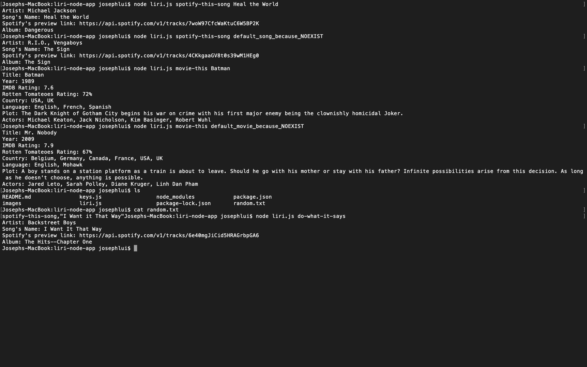

# liri-node-app

Liri node app is an AI driven app written in node.  Its functionality is similr to Siri but primarily focus on searches in Spotify for songs and OMDB for movies.  Liri provies up to date information on movies and songs you are looking for.

## Getting Started

The quickest way to get started is to download the repo and run the following commands to start the app.

node spotify-this-song [song name] 
node movie-this [movie name]  

### Prerequisites

In order to connect to Spotify, you will need to obtain an API key from Spotify.  Visit <a href="https://developer.spotify.com/my-applications/#!/">Spotify Registrtaion</a>. 

### Installing

1)  Clone the repository
2)  Obtain a registrtion key from Spotify
3)  Enter the Spotify API key in .env file
4)  Run the following command to search for a song from Spotify:
    node spotify-this-song [song name]
    Eg: node liri.js spotify-this-song heal the world
5)  Run the following command to search for a movie from OMDB :
    node movie-this [movie name]
    Eg: node liri.js movie-this Harry Potter
6)  You can also specify your command in random.txt
    The file takes 2 parameters.  The first parameter can be spotify-this-song or movie-this.  The second parameter specifies the name of the song or name of the movie depending on the first parameter.  Once the file is ready, you can run the following command to execute the instruction in random.txt.
    Eg: node liri.js do-what-it-says
7)  If a movie cannot be found, the recommended movie would be "Mr. Nobody".
8)  If a song cannot be found, the recommended song would be "The Sign".
9)  The result will be displayed nicely in console.

## Running the tests

N/A

### Break down into end to end tests

N/A

### And coding style tests

N/A

## Deployment

N/A

## Built With

N/A

## Contributing

Please read [CONTRIBUTING.md](https://gist.github.com/PurpleBooth/b24679402957c63ec426) for details on our code of conduct, and the process for submitting pull requests to us.

## Versioning

We use [SemVer](http://semver.org/) for versioning. For the versions available, see the [tags on this repository](https://github.com/your/project/tags). 

## Authors

* **Joseph Lui** - *Initial work*

